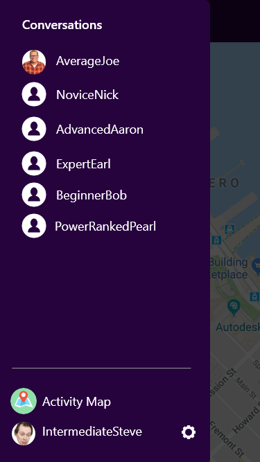

# Show Me Your Moves

### **Show Me Your Moves is a mobile app that allows Super Smash Bros players to connect with each other and play.**

## Background and Overview

As students at App Academy who love playing Super Smash Brothers, we want to create an application connecting Smash Players to each other locally.

Currently there are ways to organize online games, but there are not any easy ways to to find players near you.

This app aims to bridge the gap between players. We know there are a lot of players in the Bay area who want to connect and play Smash together.

Our app consists of two key features:

- A map that shows other Smash Players around you
- A way to connect and chat with those players

## Functionality & MVP

- [ ] An activity map that shows other Smash Players and Hosts around the user
- [ ] A 'More Info' page for both Smash Players and Hosts
- [ ] A message button that opens up a chat window
- [ ] Login with FaceBook, Google, and regular login
- [ ] A sidebar that shows all of the user's previous chats
- [ ] User profile settings allows user to choose if they're a Host or just a Smash Player

### Bonus Features

- [ ] A 'Report' button to report bad Smash Players/Hosts
- [ ] Nearby tournament locator

## Technologies & Technical Challenges

**Backend: Ruby/Rails**

**Frontend: React Native/JavaScript/Redux**

### Logging In with OAuth

- Incorporate Facebook/Google login with React Native as well as a Rails backend. At a quick Google search, we saw guides that are good for having a Node.js backend, but not Rails, so we'll need to figure this out.

### Location Challenges (Google Maps Integration)

- Integrating Google maps so that it's the main page that users are taken to as soon as they log in.
- User's personal privacy is important so we want a way to not broadcast their addresses publicly but still show their general location on the map (similar to Airbnb) with a pin drop/marker.
- We need a way to only show users within some radius of your location instead of all users in the world.

- Making a clear easy to use interface on the map.
  - The main functionality will be the map so it's going to have to be really easy to use.

### Chat (WebSockets)

- Getting live chat and push notifications up and running via WebSockets
- Ensure that it's easy to find past conversations, as well as create new ones

### User Flow

- Users will be taken to the settings page immediately after they sign up for the first time, but then after they log in later, they're taken to the map instead.
- Ensuring general UX is smooth and intuitive. No hard to find/hard to use functionalities.

### Git Workflow

- Create a system to effectively collaborate even when we're working separately with Git.

## Wireframes

Adobe XD link is provided at the bottom with working prototype functionality. All images larger than normal size are scrollable.

- OAuth Login

- Email Login

- Email Signup

- Activity Map

- Activity Map - Player Selected

- Player Messaging

- Player Detail

- Activity Map - Host Selected

- Host Detail Index

- Host Player Detail

- Hamburger Menu/Sidebar

- User Settings

- Adobe XD Prototype

https://xd.adobe.com/view/ca63fccb-19f6-4d65-adbf-9bb6c189288c

## Accomplished over the Weekend

- Research new technologies used by the app, such as
  - React.native
  - OAuth2.0
  - WebSockets
  - Google Maps Geolocation
- Setup a simple `react-native` application
- Test the `react-native` app on a mobile device
- Setup OAuth API keys
- Create proposal

## Group Members & Work Breakdown

### Ethan Bjornsen, Francis Lara, Brillante Wang

Expectation is that with each thing done, CSS/styling will be 100% completed as well.

### Day 1

- [ ] Figure out Git workflow (EB, FL, BW)
- [ ] Setup boiler plate code for Redux cycle for session (reducers, actions, api util) (FL)
  - Reducers
  - Actions
  - API Util
- [ ] Start getting basic Rails backend setup (BW)
  - User model
  - Users and Sessions controllers
  - Routes
  - Setup PostgreSQL
  - Run rails migrations
- [ ] Get login and signup forms functioning (BW)
  - FaceBook login
  - Google login
  - Regular login
  - Regular signup
- [ ] Start working on Google Maps integration (EB)

### Day 2

- [ ] Finish integrating with Google Maps (EB)
- [ ] Start building Activity Map functionality (EB)
  - Get Players and Host to show up on map based on user's location
  - Have modal thing slide up from bottom when you click on a Smash Player or Host with:
    - 'More Info' button (live link)
    - 'Message' button (doesn't do anything yet. dead link for now)
    - Skill level and main Smash game info
- [ ] Finish building Rails backend and smooth out login/signup bugs (BW)
- [ ] Build app header component (BW)
  - Header text
  - Hamburger menu
  - Back button depending on current page
- [ ] Start building side bar menu (BW)
  - list of previous chats (dead links for now)
  - link to User Settings (live link)
  - link to Activity Map (live link)
- [ ] Finish building session Redux cycle (FL)
- [ ] Start building User Settings component (FL)
  - user settings form
  - image upload functionality
- [ ] Start building 'More Info' component (FL)
  - Host
  - Smash Player

### Day 3

- [ ] Finish Activity Map (EB)
- [ ] Finish User Settings (FL)
- [ ] Finish More Info (FL)
- [ ] Finish Side Bar (BW)
- [ ] Start building Chat component (FL)
  - Websocket functionality
- [ ] Start setting up chat history backend (BW)
  - Run rails migration
    - Chats table

### Day 4

- [ ] Finish Chat component (FL)
- [ ] Finish Chat history backend setup (BW)
  - Add 'fetch chat' functionality within Side Bar component
- [ ] Work through Activity Map quirks (EB)
- [ ] Push app to Heroku (EB)
- [ ] Start working on demo page (all)

### Day 5

- [ ] Continue working through bugs (all)
- [ ] Finish demo page (all)
- [ ] User testing with friends and family (all)
- [ ] Polish UI/UX (all)

### Day 6

- [ ] Push to app store (all)
- [ ] Create README (all)
